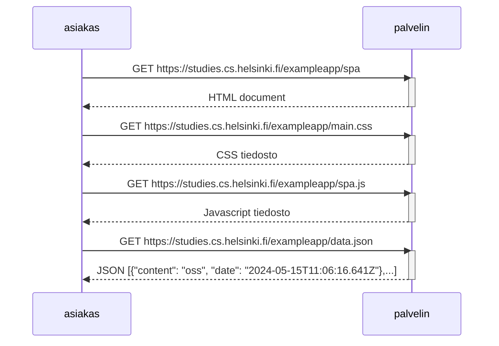

```mermaid
sequenceDiagram
  participant asiakas
  participant palvelin

  asiakas->>palvelin: GET https://studies.cs.helsinki.fi/exampleapp/spa
  activate palvelin
  palvelin-->>asiakas: HTML document
  deactivate palvelin
  asiakas->>palvelin: GET https://studies.cs.helsinki.fi/exampleapp/main.css
  activate palvelin
  palvelin-->>asiakas: CSS tiedosto
  deactivate palvelin
  asiakas->>palvelin: GET https://studies.cs.helsinki.fi/exampleapp/spa.js
  activate palvelin
  palvelin-->>asiakas: Javascript tiedosto
  deactivate palvelin
  asiakas->>palvelin: GET https://studies.cs.helsinki.fi/exampleapp/data.json
  activate palvelin
  palvelin-->>asiakas: JSON [{"content": "oss", "date": "2024-05-15T11:06:16.641Z"},...]
  deactivate palvelin
```
