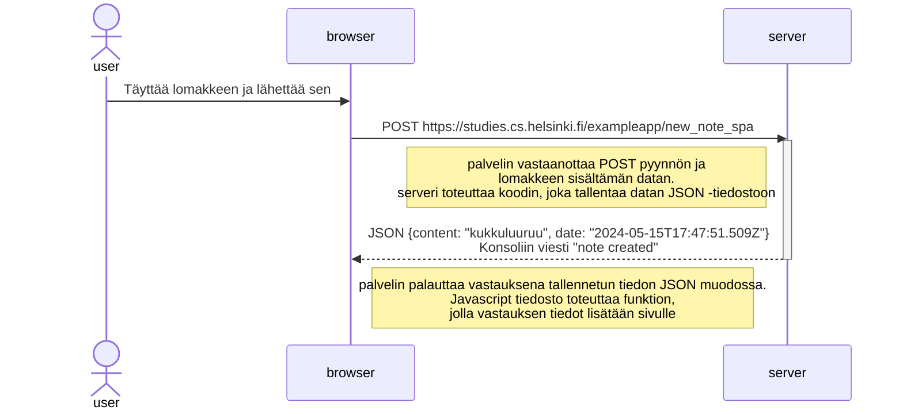

```mermaid
sequenceDiagram
  actor user
  participant browser
  participant server

  user->>browser: Täyttää lomakkeen ja lähettää sen
  browser->>server: POST https://studies.cs.helsinki.fi/exampleapp/new_note_spa
  activate server
  note left of server: palvelin vastaanottaa POST pyynnön ja<br/>lomakkeen sisältämän datan.<br/>serveri toteuttaa koodin, joka tallentaa datan JSON -tiedostoon
  server-->>browser: JSON {content: "kukkuluuruu", date: "2024-05-15T17:47:51.509Z"}<br/>Konsoliin viesti "note created"
  deactivate server
  note right of browser: palvelin palauttaa vastauksena tallennetun tiedon JSON muodossa.<br/>Javascript tiedosto toteuttaa funktion,<br/>jolla vastauksen tiedot lisätään sivulle
  
  

```
